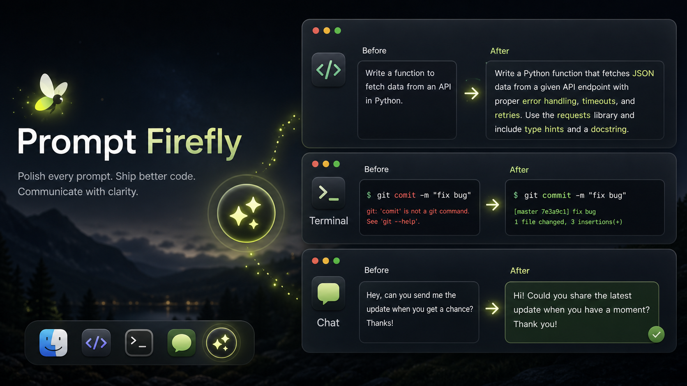

<p align="center">
  
</p>

<h1 align="center">Prompt Firefly</h1>

<p align="center">
  A tiny macOS assistant that rewrites the text you are already typing, right where you are typing it.
</p>

<p align="center">
  <a href="#install"><strong>Install</strong></a>
  ·
  <a href="#what-it-does">What it does</a>
  ·
  <a href="#permissions">Permissions</a>
  ·
  <a href="#develop">Develop</a>
</p>

<p align="center">
  
  
  
  
</p>

<p align="center">
  
</p>

## Install

Copy this command into Terminal:

```bash
/bin/bash -c "$(curl -fsSL https://raw.githubusercontent.com/skverall/prompt-firefly/main/install.sh)"
```

The installer will:

- download Prompt Firefly,
- build the macOS app locally,
- install it to `~/Applications/PromptFirefly.app`,
- launch the app,
- open the macOS Accessibility settings page.

If Apple Command Line Tools are missing, macOS will open the installer for them. Finish that installation, then run the same command again.

## First Setup

1. In `System Settings -> Privacy & Security -> Accessibility`, turn on `PromptFirefly`.
2. Open Prompt Firefly settings.
3. Paste your DeepSeek API key.
4. Click `Save`.
5. Click into any text field, then press the floating firefly button.

Prompt Firefly stores your API key in macOS Keychain, not in project files.

## What It Does

Prompt Firefly adapts to the app you are using:

| Where you type | What Prompt Firefly does |
| --- | --- |
| Codex, ChatGPT, Claude, Cursor, VS Code | Rewrites rough instructions into clearer AI/coding prompts. |
| Terminal, iTerm | Corrects the current command line and pastes it back without pressing Enter. |
| Telegram, Slack, Mail, Messages | Polishes the text as a normal human message. |
| Other text fields | Improves the selected or focused text without assuming it is a coding prompt. |

It also avoids a common AI-tool bug: internal plugin/cache paths such as `.codex/plugins/cache/...` are ignored unless you clearly typed that path yourself.

## Examples

### AI Coding Prompt

Before:

```text
fix this auth thing and dont break signup
```

After:

```text
Find and fix the authentication issue without regressing the signup flow. Reproduce the problem, identify the root cause, apply the smallest safe fix, and run the relevant checks.
```

### Terminal Command

Before:

```bash
gti stauts
```

After:

```bash
git status
```

Prompt Firefly does not press Enter. You review the command and run it yourself.

### Chat Message

Before:

```text
send me update when free
```

After:

```text
Could you send me an update when you have a moment?
```

## Permissions

Prompt Firefly needs macOS Accessibility permission so it can read and replace text in the focused field.

Open permissions manually:

```bash
open "x-apple.systempreferences:com.apple.preference.security?Privacy_Accessibility"
```

For Terminal/iTerm support, macOS may also ask for permission to control Terminal. This is used to read the current command line before rewriting it.

## Update

Run the installer again:

```bash
/bin/bash -c "$(curl -fsSL https://raw.githubusercontent.com/skverall/prompt-firefly/main/install.sh)"
```

## Uninstall

```bash
/bin/bash -c "$(curl -fsSL https://raw.githubusercontent.com/skverall/prompt-firefly/main/install.sh)" -- --uninstall
```

You can also remove the Accessibility permission in System Settings.

## Develop

Clone the repo and run the local dev launcher:

```bash
git clone https://github.com/skverall/prompt-firefly.git
cd prompt-firefly
./script/build_and_run.sh
```

Run a build check:

```bash
swift build
```

## Configuration

Defaults:

- Base URL: `https://api.deepseek.com`
- Model: `deepseek-v4-flash`

You can change both in Prompt Firefly settings.

## Privacy

Prompt Firefly sends the focused text to your configured DeepSeek-compatible API endpoint.

For coding apps and terminals, it may also include lightweight project context, such as top-level files, README/AGENTS snippets, and git status. For chat and mail apps, it does not attach local project context.

## License

MIT
